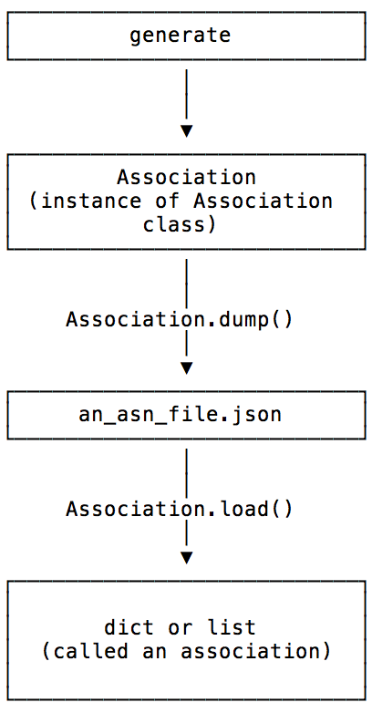
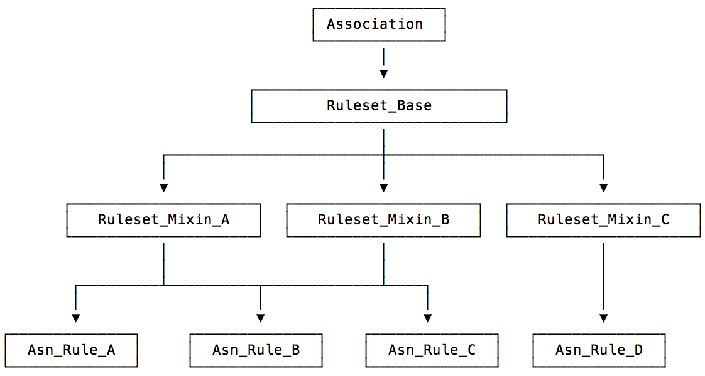

.. _design-association:

Associations and Rules
======================

Terminology
-----------

As :ref:`has been described <asn-what-are-associations>`, an ``Association``
is a Python dict or list that is a list of things that belong together
and are created by association rules. However, as will be described,
the association rules are Python classes which inherit from the
``Association`` class.

Associations created from these rule classes, refered to as just
``rules``, have the type of the class they are created from and have all
the methods and attributes of those classes. Such instances are used
to populate the created associations with new members and check the
validity of said associations.

However, once an association has been saved, or serialized, through
the :meth:`Association.dump
<jwst.associations.association.Association.dump>` method, then reload
through the corresponding :meth:`Association.load
<jwst.associations.association.Association.load>` method, the restored
association is only the basic list or dict. The whole instance of the
originating association is not serialized with the basic membership
information.

This relationship is shown in the following figure:

   Rule vs. Association Relationship

Note About Loading
^^^^^^^^^^^^^^^^^^

:meth:`Association.load
<jwst.associations.association.Association.load>` will only validate
the incoming data against whatever schema or other validation checks
the particular subclass calls for. The generally preferred method for
loading an association is through the
:func:`jwst.associations.load_asn` function.

.. _asn-design-rules:

Rules
-----

Association rules are Python classes which must inherit from the
:class:`~jwst.associations.association.Association` base class. What
the rules do and what they create are completely up to the rules
themselves. Except for a few :ref:`core methods
<ref-asn-core-methods>`, the only other requirement is that any
instance of an association rule must behave as the association it
creates. If the association is a dict, the rule instance must behave
as the dict. If the association is a list, the rule instance must
behave as a list. Otherwise, any other methods and attributes the
rules need for association creation may be added.

Rule Sets
---------

In general, because a set of rules will share much the same
functionality, for example how to save the association and how to
decide membership, it is suggested that an intermediate set of classes
be created from which the rule classes inherit. The set of rule
classes which share the same base parent classes are referred to as a
*rule set*. The JWST :ref:`Level 2<asn-level2-techspecs>` and
:ref:`Level 3<asn-level3-techspecs>` are examples of such rule sets.
The below figure demonstrates the relationships between the base
``Association``, the defining ruleset classes, and the rule classes
themselves.

   Rule Inheritance

Where Rules Live: The AssociationRegistry
-----------------------------------------

In order to be used, rules are loaded into an
:ref:`design-registry`. The registry is used by the
:py:func:`~jwst.associations.generate` to produce the associations. The registry is
also used by the :py:func:`~jwst.associations.load_asn` function to
validate a potential association data against list of rules.
