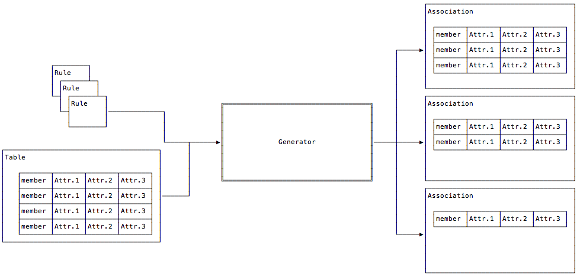
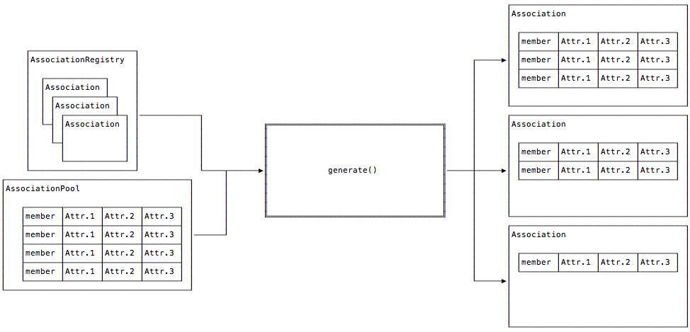

.. _design:

Association Design
==================

As introduced in the :ref:`asn-overview`,
:ref:`Figure 1 <figure-association-generator-overview>`
shows all the major players used in generating associations.
Meanwhile, :ref:`Figure 2 <figure-class-overview>` is the overview but
using the class names involved.

.. _figure-association-generator-overview:

   Association Generator Overview

.. _figure-class-overview:

   Association Class Relationship overview
