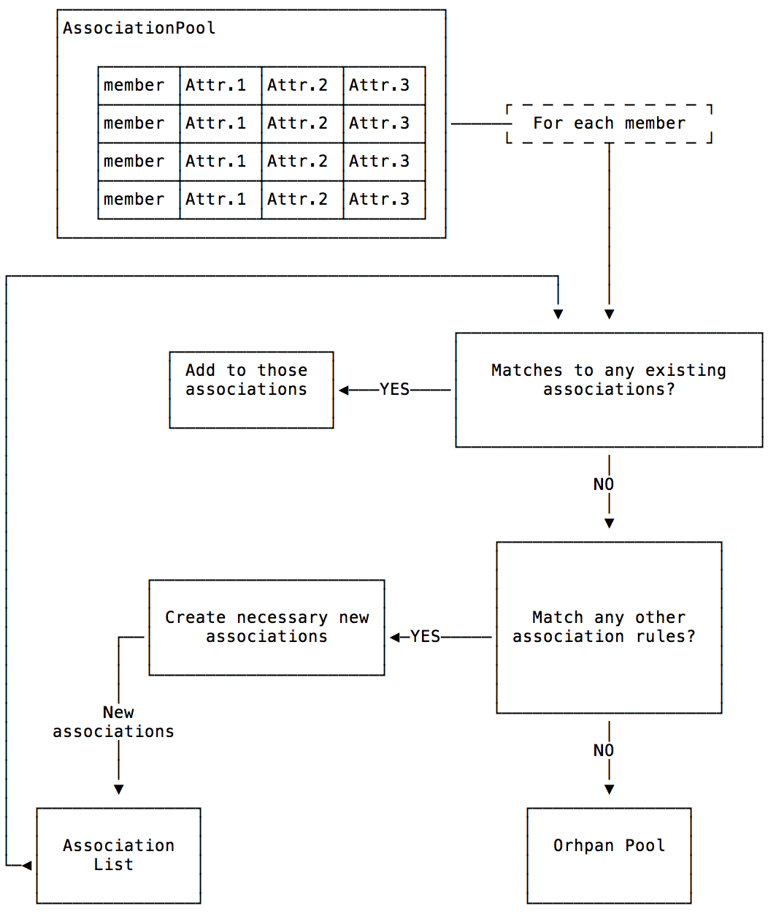
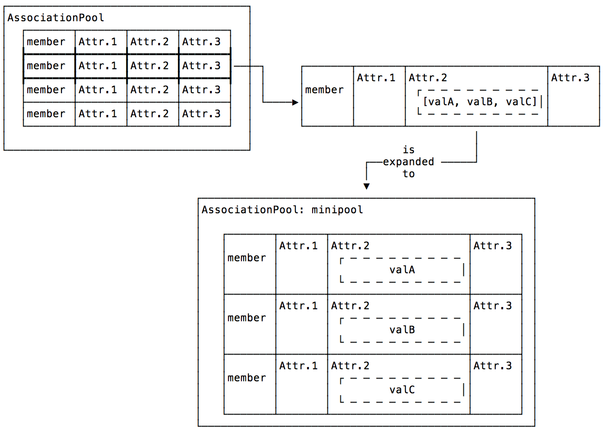

.. _design-generator:

Generator
=========

Algorithm
---------

The generator conceptual workflow is show below:

   Generator Conceptual Workflow

This workflow is encapsulated in the :py:func:`~jwst.associations.generate`
function. Each member is first checked to see if it belongs to an already
existing association. If so, it is added to each association it matches with.
Next, the set of association rules are check to see if a new association, or
associations, are created by the member. However, only associations that have
not already been created are checked for. This is to prevent cyclical creation
of associations.

As discussed in :ref:`design-association`, associations are Python
classes, often referred to as ``association rules``, and their
instantiations, referred to as ``associations``. An association is
created by calling the :meth:`Association.create
<jwst.associations.association.Association.create>` class method for each
association rule. If the member matches the rule, an association is
returned. Each defined rule tried. This process of checking whether a
member would create any associations is encapsulated in the
:meth:`AssociationRegistry.match
<jwst.associations.registry.AssociationRegistry.match>` method

Conversely, to see if a member belongs to an already existing
association, an attempt is made to add the member using the
:meth:`Association.add
<jwst.associations.association.Association.add>` method. If the
addition succeeds, the member has been added to the association
instance. The generator uses :func:`match_member
<jwst.associations.generate.match_member>` function to loop through
its list of existing associations.

Output
------

Before exiting, :py:func:`~jwst.associations.generate` checks the
:meth:`Association.is_valid
<jwst.associations.association.Association.is_valid>` property of each
association to ensure that an association has all the members it is required to
have. For example, if a JWST coronagraphic observation was performed, but the
related PSF observation failed, the coronagraphic association would be marked invalid.

Once validation is complete, :py:func:`~jwst.associations.generate` returns a
2-tuple. The first item is a list of the associations created. The second item
is another :py:class:`~jwst.associations.AssociationPool` containing all the
members that did not get added to any association.

.. _member-with-lists:

Member Attributes that are Lists
--------------------------------

As mentioned in :ref:`design-pool`, most member attributes are simply
treated as strings. The exception is when an attribute value looks
like a list::

  [element, ...]

When this is the case, a *mini pool* is created. This pool consists of
duplicates of the original member. However, for each copy of the member, the
attribute that was the list is now populated with consecutive members of that
list. This mini pool and the rule or association in which this was found, is
passed back up to the :py:func:`~jwst.associations.generate` function to be
reconsidered for membership. Each value of the list is considered separately
because association membership may depend on what those individual values are.
The figure below demonstrates the member replication.

   Member list expansion

   Attr.2 is a list of three values which expands into three members
   in the mini pool.

For JWST, this is used to filter through the various types of
association candidates. Since an exposure can belong to more than one
association candidate, the exposure can belong to different
associations depending on the candidates.

.. _design-candidates:

Association Candidates
----------------------

TBD
