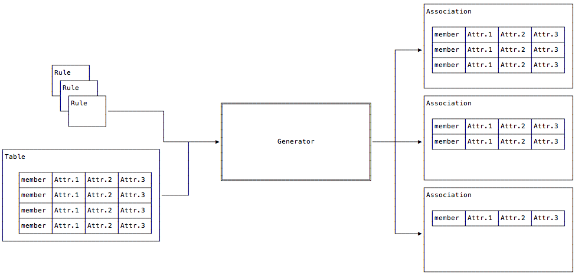

.. _asn-overview:

======================
Association Processing
======================

.. _what-are-associations:

What are Associations?
======================

Associations are basically just lists of things, mostly exposures,
that are somehow related. With respect to JWST and the Data Management
System (DMS), associations have the following characteristics:

- Relationships between multiple exposures are captured in an association.
- An association is a means of identifying a set of exposures that belong together and may be dependent upon one another.
- The association concept permits exposures to be calibrated, archived, retrieved, and reprocessed as a set rather than as individual objects.
- For each association, DMS will generate the most combined and least combined data products.

Associations are used as the primary input to various Level2 and
Level3 JWST :ref:`pipeline modules <pipeline-classes>`.

In DMS, associations are created by the :ref:`association generator
<asn-generate>`. The association generator is basically a classifier.
The generator takes, as input, a table and one or more :ref:`rules <asn-design-rules>`.
Based on the rules, the generator takes each row of the table and
classifies it, placing that row into one or more associations. These
relationships are show in the figure below.

.. _asn-association-types:

Association Types
=================

Each association is intended to make a specific science
product. The type of science product is indicated by the `ATYPE` field
in the association file name (see :ref:`asn-DMS-naming`), and in the `asn_type` meta
keyword of the association itself (see :ref:`asn-association-meta-keywords`).

The pipeline uses this type as the key to indicate which Level 2 or
Level 3 pipeline module to use to process this association.

The current association types are:

  * `image3`: Intended for `calwebb_image3` processing
  * `spec3`: Intended for `calwebb_spec3` processing
  * `wfs`: Wave front sensing data, used by `wfs_combine`
  * `ami3`: Intended for `calwebb_ami3` processing
  * `coron3`: Intended for `calwebb_coron3` processing
  * `tso3`: Intended for `calwebb_tso3` processing
  * `image2`: Intended for `calwebb_image2` processing
  * `spec2`: Intended for `calwebb_spec2` processing

.. _association-generator:

Association Generator Overview
==============================

The actual structure of the resulting associations is completely
determined by the rules themselves, though it is expected that the
rows from the originating table that created the association are
actually in the association. The generator was initially developed to
support the JWST pipeline, which requires two types of rules. These
predefined rules, called :ref:`Level2 <level2-associations>` and
:ref:`Level3 <level3-associations>`, produce associations targeted to
specific level2 and level3 pipelines.

As they define the structures of the associations, the rules also
define the format of how the associations are written. For the JWST
predefined rules, the output are a series of `JSON` or `YAML`
formatted files for each association created.

Usage
-----

Users should not need to run the generator. Instead, it is expected
that one edits an already existing association that accompanies the
user's JWST data. Or, if need be, an association can be created based
on the existing :ref:`Level2 <asn-level2-example>` or
:ref:`Level3 <asn-level3-example>` examples.

Once an association is in-hand, one can pass it as input to a pipeline
routine. For example::

  % strun calwebb_image3.cfg  jw12345_xxxx_asn.json

Programmatically, to read in an Association, one uses the
:func:`~jwst.associations.load_asn.load_asn` function:

.. code-block:: python

   from jwst.associations import load_asn

   with open('jw12345_xxxx_asn.json') as fp:
       asn = load_asn(fp)

What exactly is returned depends on what the association is. However,
for all Level2 and Level3 associations, a Python `dict` is returned,
whose structure matches that of the `JSON` or `YAML` file. Continuing
from the above example, the following shows how to access the first
exposure file name of a Level3 assocations::

  exposure = asn['products'][0]['members'][0]['expname']

Since the JWST pipeline uses associations extensively, higher-level
access is gained by opening an association as a :ref:`JWST Data
Model`:

.. code-block:: python

  from jwst.datamodels import open as dm_open
  container_model = dm_open('jw12345_xxxx_asn.json')

Generator Usage
---------------

Basic use of the association generator is done through two methods.
From the command-line, the generator is invoked using the command
:ref:`asn_generate <asn-generate>`. From Python, the generator\'s
:ref:`Main` is instantiated.

.. _level3-asn-jwst-overview:

JWST Associations
=================

The basic chunk in which science data arrives from the observatory is
termed an `exposure`. An exposure contains the data from a single set
of integrations per detector per instrument. In general, it takes many
exposures to make up a single observation, and a whole program is made
up of a large number of observations.

On first arrival, an exposure is termed to be at `Level1b`: The only
transformation that has occured is the extraction of the science data
from the telescope telemetry into a FITS file. At this point, the
science exposures enter the calibration pipeline.

The pipeline consists of two stages: Level2 processing and Level3
processing. Level2 processing is the calibration necessary to remove
instrumental effects from the data. The resulting files contain flux
and spatially calibrated data, called `Level2b` data. The information
is still in individual exposures.

To be truly useful, the exposures need to be combined and, in the case
of multi-object spectrometry, separated, into data that is
source-oriented. This type of calibration is called `Level3`
processing. Due to the nature of the individual instruments, observing
modes, and the interruptability of the observatory itself, how to
group the right exposures together is not straight-forward.

Enter the :ref:`Association Generator <association-generator>`. Given a set of exposures,
called the :ref:`Association Pool <asn-pool>`, and a set of rules found in an
:ref:`Association Registry <asn-registry>`, the generator groups the exposures into
individual :ref:`associations <association>`. These associations are
then used as input to the Level3 calibration steps to perform the
transformation from exposure-based data to source-based, high(er)
signal-to-noise data.

In short, Level 3 associations are created running the
:ref:`asn_generate <asn-generate>` task on an :ref:`Association Pool
<asn-pool>` using the default :ref:`Level 3 Association Rules
<level3-asn-rules>` to produce :ref:`level3-associations`.
