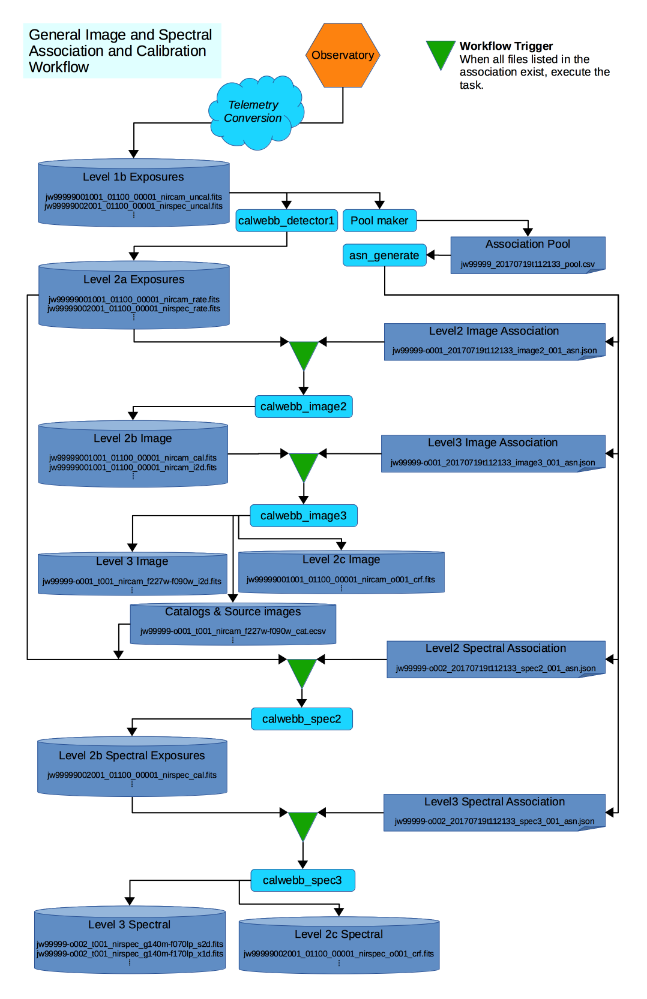
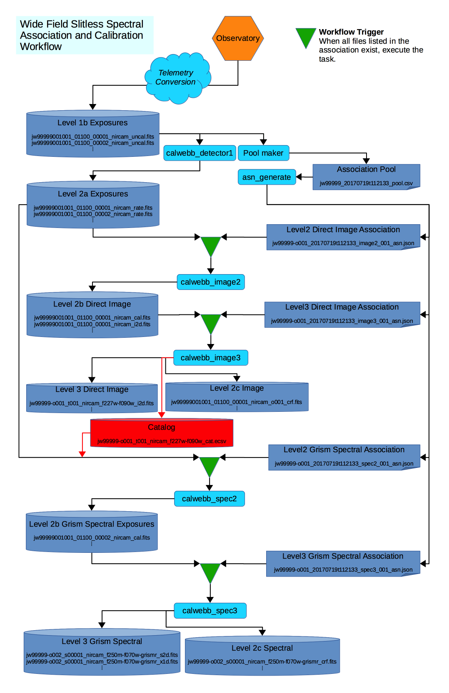

.. _sdp-workflow:

================================
Science Data Processing Workflow
================================

General Workflow for Generating Association Products
====================================================

See :ref:`asn-associations-and-jwst` for an overview of how JWST uses
associations. This document describes how associations are used by the
ground processing system to execute the stage 2 and stage 3 pipelines.

Up to the initial calibration step :ref:`calwebb_detector1 <calwebb_detector1>`,
the science exposures are treated individually. However, starting at the stage 2
calibration step, exposures may need other exposures in order to be further
processed. Instead of creating a single monolithic pipeline, the workflow uses
the associations to determine what pipeline should be executed and when to
execute them. In the figure below, this wait-then-execute process is represented
by the ``workflow trigger``. The workflow reads the contents of an association
file to determine what exposures, and possibly other files, are needed to
continue processing. The workflow then waits until all exposures exist. At that
point, the related calibration pipeline is executed with the association as input.

With this finer granularity, the workflow can run more processes parallel,
and allows the operators deeper visibility into the progression of the
data through the system.

   General workflow through stage 2 and stage 3 processing

The figure represents the following workflow:

- Data comes down from the observatory and is converted to the raw
  FITS files.
- :ref:`calwebb_detector1 <calwebb_detector1>` is run on each file to convert the data to the
  countrate format.
- In parallel with :ref:`calwebb_detector1 <calwebb_detector1>`, the Pool Maker collects the list
  of downloaded exposures and places them in the Association Pool.
- When enough exposures have been download to complete an Association
  Candidate, such as an Observation Candidate, the Pool Maker calls
  the Association Generator, :ref:`asn_generate <asn-generate>`, to create the set of
  associations based on that Candidate.
- For each association generated, the workflow creates a file watch
  list from the association, then waits until all exposures needed by
  that association come into existence.
- When all exposures for an association exist, the workflow then
  executes the corresponding pipeline, passing the association as
  input.

Wide Field Slitless Spectroscopy
================================

In most cases, the data will flow from stage 2 to stage 3, completing
calibration. However, more complicated situations can be handled by
the same wait-then-execute process. One particular case is for the
Wide Field Slitless Spectrometry (WFSS) modes. The specific flow is
show in the figure below:

   WFSS workflow

For WFSS data, at least two observations are made, one consisting of a
direct image of the field-of-view (FOV), and a second where the FOV is
dispersed using a grism. The direct image is first processed through
stage 3. At the stage 3 stage, a source catalog of objects found in
the image, and a segmentation map, used to record the minimum bounding
box sizes for each object, are generated. The source catalog is then used
as input to the stage 2 processing of the spectral data. This extra
link between the two major stages is represented by the ``Segment &
Catalog`` file set, shown in red in the diagram. The stage 2 association
``grism_spec2_asn`` not only lists the needed countrate exposures, but
also the catalog file produced by the stage 3 image
processing. Hence, the workflow knows to wait for this file before
continuing the spectral processing.
