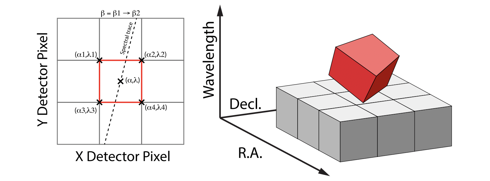
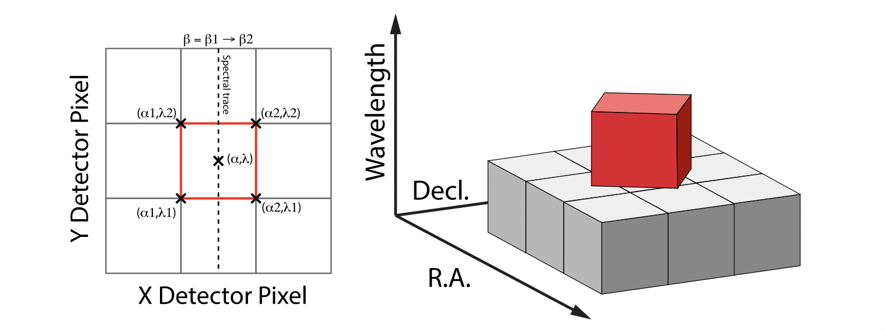
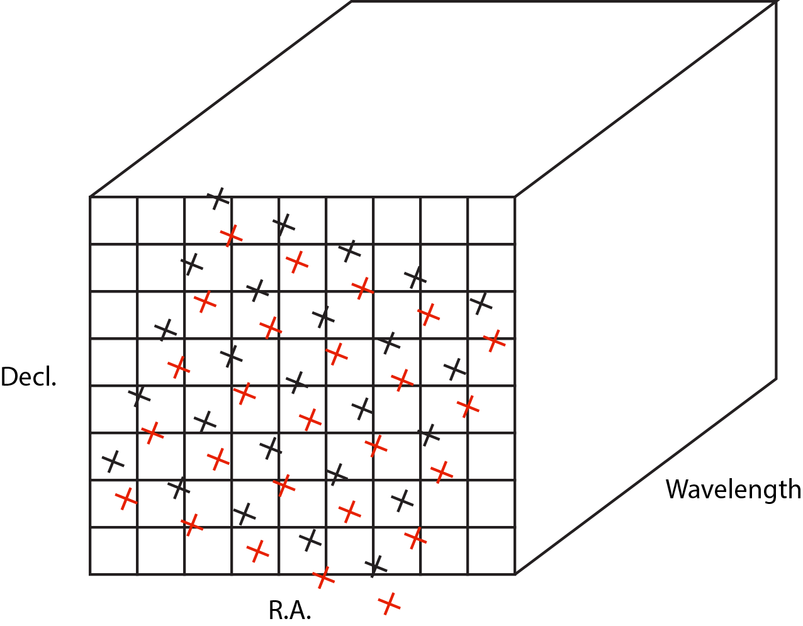

Description
===========

:Class: `jwst.cube_build.CubeBuildStep`
:Alias: cube_build

The ``cube_build`` step takes MIRI or NIRSpec IFU calibrated 2-D images and produces
3-D spectral cubes. The 2-D disjointed IFU slice spectra are corrected
for distortion and assembled into a rectangular cube with three orthogonal axes: two
spatial and one spectral.

The ``cube_build`` step can accept several different forms of input data, including:

  - a single file containing a 2-D IFU image

  - a data model (IFUImageModel) containing a 2-D IFU image

  - an association table (in json format) containing a list of input files

  - a model container with several 2-D IFU data models

There are a number of arguments the user can provide either in a parameter file or
on the command line that control the sampling size of the cube, as well as the type of data
that is combined to create the cube. See the :ref:`arguments` section for more details.

Assumptions
-----------
It is assumed that the :ref:`assign_wcs <assign_wcs_step>` step has been applied to the data, attaching the distortion and pointing
information to the image(s). It is also assumed that the  :ref:`photom <photom_step>` step has been applied to convert the pixel
values from units of count rate to surface brightness. This step will only work with MIRI or NIRSpec IFU data.
The cube_build algorithm is a flux conserving method, requires the input data to be in units of surface brightness
(MJy/sr), and produces 3-D cubes also in units of surface brightness.  1-D spectral extraction from these cubes may then
produce spectra either in surface brightness units of MJy/sr or in flux units of Jy.

The NIRSpec calibration plan for point source data is designed to produce units of flux density from the calwebb_spec2 pipeline.
For NIRSpec IFU point source data the calwebb_spec2 pipeline divides the flux values by a pixel area map to produce pseudo
surface brightness units (MJy/steradian). This allows the cube_build program to conserve flux when it combines and resamples
the data. True fluxes are produced only at the :ref:`extract_1d_step <extract_1d_step>`, in which a 1D spectrum is extracted from the cube using an
appropriate extraction aperture, with resulting units of Jy.

Instrument Information
----------------------
The JWST integral field unit (IFU) spectrographs obtain simultaneous spectral and spatial data on a relatively compact
region of the sky.

The MIRI Medium Resolution Spectrometer (MRS) consists of four IFUs
providing simultaneous and overlapping fields of view ranging from ~3.3" x 3.7" to ~7.2" x 7.7" and covering a
wavelength range of 5-28 microns. The optics system for the four IFUs is split into two paths. One path
is dedicated to the two short wavelength IFUs and the other one handles the two longer wavelength IFUs.
There is one 1024 x 1024 detector for each path. Light entering the MRS is spectrally separated into four
channels by dichroic mirrors. Each of these channels has its own IFU that divides the image into several
slices. Each slice is then dispersed using a grating spectrograph and imaged on one half of a detector. While
four channels are observed simultaneously, each exposure only records the spectral coverage of
approximately one third of the full wavelength range of each channel. The full 5-28 micron spectrum is
obtained by making three exposures using three different gratings and three different dichroic sets.
We refer to a sub-channel as one of the three possible configurations (A/B/C) of the channel where each
sub-channel covers ~1/3 of the full wavelength range for the channel. Each of the four channels has a different
sampling of the field, so the FOV, slice width, number of slices, and plate scales are different for each channel.

The NIRSpec IFU has a 3 x 3 arcsecond field of view that is sliced into thirty 0.1 arcsecond regions. Each slice is
dispersed by a prism or one of six diffraction gratings.  The NIRSpec IFU gratings
provide high-resolution and  medium resolution  spectroscopy while the prism yields lower-resolution spectroscopy.
The NIRSpec detector focal plane consists of two HgCdTe sensor chip assemblies (SCAs). Each SCA is a 2-D array of
2048 x 2048 pixels.  For low or medium resolution IFU data the 30 slices are imaged on
a single NIRSpec SCA. In high resolution mode the 30 slices are imaged on the two NIRSpec SCAs. 

Terminology
-----------

General IFU Terminology
+++++++++++++++++++++++

``pixel``
  A pixel is a physical 2-D element of the detector focal plane arrays.

``spaxel``
  A spaxel is a 2-D spatial element of an IFU rectified data cube.  Each spaxel in a data cube
  has an associated spectrum composed of many voxels.

``voxel``
  A voxel is 3-D volume element within an IFU rectified data cube.  Each voxel has two spatial dimensions and one
  spectral dimension.

MIRI Spectral Range Divisions
+++++++++++++++++++++++++++++
We use the following terminology to define the spectral range divisions of MIRI:

``Channel``
  The spectral range covered by each MIRI IFU. The channels are labeled as 1, 2, 3 and 4.

``Sub-Channel``
  The 3 sub-ranges that a channel is divided into. These are designated as *Short (A)*, *Medium (B)*, and *Long (C)*.

``Band``
  For **MIRI**, ``band`` is one of the 12 contiguous wavelength intervals (four channels times three sub-channels each)
  into which the spectral range of the MRS is divided.  Each band has a unique channel/sub-channel combination. For
  example, the shortest wavelength range on MIRI is covered by Band 1-SHORT (aka 1A) and the
  longest is covered by Band 4-LONG (aka 4C).

   For **NIRSpec** we define a *band* as a single grating-filter combination, e.g. G140M-F070LP. The possible grating/filter
   combinations for NIRSpec are given in the table below.

NIRSpec IFU Disperser and Filter Combinations
+++++++++++++++++++++++++++++++++++++++++++++

=======  ======  ====================
Grating  Filter  Wavelength (microns)*
=======  ======  ====================
Prism    Clear   0.6 -5.3
G140M    F070LP  0.90 - 1.27
G140M    F100LP  0.97 - 1.89
G235M    F170LP  1.66 - 3.17
G395M    F290LP  2.87 - 5.27
G140H    F070LP  0.95 - 1.27
G140H    F100LP  0.97 - 1.89
G235H    F170LP  1.66 - 3.17
G395H    F290LP  2.87 - 5.27
=======  ======  ====================

* Approximate wavelength ranges are given to aid in explaining  how to build NIRSpec IFU cubes, see `NIRSpec Spectral configuration <https://jwst-docs.stsci.edu/jwst-near-infrared-spectrograph/nirspec-observing-modes/nirspec-ifu-spectroscopy#NIRSpecIFUSpectroscopy-Spectralconfigurations>`_.

Types of Output Cubes
---------------------
The output 3-D spectral data consist of rectangular cube with three orthogonal axes: two
spatial and one spectral. Depending on how cube_build is run the spectral axes can be either linear or non-linear.
Linear wavelength IFU cubes are constructed from a single band of data, while non-linear wavelength IFU cubes are
created from more than one band of data. If the IFU cubes have a non-linear wavelength dimension
there will be an added binary extension table to the output fits IFU cube. This extension has
the label WCS-TABLE and contains the wavelengths for each of the IFU cube wavelength planes. This table follows the
FITs standard described in, *Representations of spectral coordinates in FITS*, Greisen, et al., **A & A**  446, 747-771, 2006. 

The input data to ``cube_build`` can take a variety of forms, including a single file, a data
model passed from another pipeline step, a list of files in an association table, or a collection of exposures in a
data model container (ModelContainer) passed in by the user or from a preceding pipeline step. Because the MIRI IFUs
project data from two channels onto a single detector, choices can or must be made as to which parts of the input data
to use when constructing the output cube even in the simplest case of a single input image. The default behavior
varies according to the context in which ``cube_build`` is being run.

In the case of the :ref:`calwebb_spec2 <calwebb_spec2>` pipeline, for example,
where the input is a single MIRI or NIRSpec IFU exposure, the default output
cube will be built from all the data in that single exposure. For MIRI this
means using the data from both channels (e.g. 1A and 2A) that are recorded in a
single exposure and the output IFU cube will have a non-linear wavelength
dimension. For NIRSpec the data is from the single grating and filter
combination contained in the exposure and will have a linear wavelength
dimension. The calwebb_spec2 pipeline calls cube_build with
``output_type=multi``.

In the :ref:`calwebb_spec3 <calwebb_spec3>` pipeline, on the other hand, where
the input can be a collection of data from multiple exposures covering multiple
bands, the default behavior is to create a set of single-channel cubes. For MIRI,
for example, this can mean separate cubes for channel 1, 2, 3 and 4. 
depending on what's included in the input. For NIRSpec this may mean
multiple cubes, one for each grating+filter combination contained in the input
collection. The calwebb_spec3 pipeline calls cube_build with
``output_type=band``. These types of IFU cubes will have a linear-wavelength
dimension. If the user wants to combine all the data together covering several
band they can using the option ``output_type=multi`` and the resulting IFU cubes
will have a non-linear wavelength dimension.

Several ``cube_build`` step arguments are available to allow the user to control exactly what combinations of input
data are used to construct the output cubes. The IFU cubes are constructed, by default, on the sky with north pointing up
and east to the left. There are also options to change the output coordinate system, see the :ref:`arguments` section for details.

Output Cube Format
------------------
The output spectral cubes are stored in FITS files that contain 4 IMAGE extensions. The primary data array is empty
and the primary header holds the basic parameters of the observations that went into making the cube.
The 4 IMAGE extensions have the following characteristics:

=======  =====  ========================  =========
EXTNAME  NAXIS  Dimensions                Data type
=======  =====  ========================  =========
SCI      3      2 spatial and 1 spectral  float
ERR      3      2 spatial and 1 spectral  float
DQ       3      2 spatial and 1 spectral  integer
WMAP     3      2 spatial and 1 spectral  integer
=======  =====  ========================  =========

The SCI image contains the surface brightness of cube spaxels in units of MJy/steradian. The wavelength dimension of the IFU cube
can either be linear or non-linear. If the wavelength is non-linear, then the IFU cube contains data from more than one band.  A
table containing the wavelength of each plane is provided and conforms to the  'WAVE_TAB' fits convention. The wavelengths
in the table are read in from the cubepar reference file.  The ERR image contains the
uncertainty on the SCI values, the DQ image contains the data quality flags for each spaxel, and the WMAP image
contains the number of detector pixels contributing to a given voxel. The data quality flag does not propagate the
dq flags from previous steps but is defined in the cube build step as: good data (value = 0), non_science (value = 512),
do_not_use(value =1), or a combination of non_science and do_not_use (value = 513).

The SCI and ERR cubes are populated with NaN values for voxels where there is no valid data (e.g., outside
the IFU cube footprint or for saturated pixels for which no slope could be measured).

Output Product Name
-------------------
If the input data is passed in as an ImageModel, then the IFU cube will be passed back as an IFUCubeModel. The cube
model will be written to disk at the end of processing.  The file name of the output cube is based on a rootname plus
a string defining the type of IFU cube, along with the suffix 's3d.fits'. If the input data is a single exposure,
then the rootname is taken from the input filename. If the input is an association table, the rootname is defined in
the association table.
The string defining the type of IFU is created according to the following rules:

- For MIRI the output string name  is determined from the  channels and sub-channels used.
  The  IFU string for MIRI is 'ch'+ channel numbers used plus a string for the subchannel. For example if the IFU cube
  contains channel 1 and 2 data for the short subchannel, the output name would be, rootname_ch1-2_SHORT_s3d.fits.
  If all the sub-channels were used then the output name would be rootname_ch-1-2_ALL_s3d.fits.

- For NIRSpec the output string is determined from the gratings and filters used. The gratings are grouped together in a dash (-)
  separated string and likewise for the filters. For example if the IFU cube contains data from
  grating G140M and G235M and from filter F070LP and F100LP,  the output name would be,
  rootname_G140M-G225_F070LP-F100LP_s3d.fits

.. _algorithm:

Algorithm
---------
The type of output IFU cube created depends on which pipeline is being run,
:ref:`calwebb_spec2 <calwebb_spec2>` or  :ref:`calwebb_spec3 <calwebb_spec3>`, 
and if additional
user provided options are being set  (see the :ref:`arguments` section.). 
Based on the pipeline setting and any user provided arguments defining the type of cubes to create, the program selects 
the data from each exposure that should be included in the spectral cube. The  output cube is defined using the WCS 
information of all the input data. The input data are mapped to the output frame based on the wcs information that is
filled in by the :ref:`assign_wcs <assign_wcs_step>` step, this mapping includes any dither offsets.
Therefore, the default output cube WCS defines a field-of-view that encompasses the undistorted footprints on
the sky of all the input images.
The output sampling scale in all three dimensions for the cube
is defined by a cubepar reference file as a function of wavelength, and can also be changed by the user.
The cubepar reference file contains a predefined scale to use
for each dimension for each band. If the output IFU cube contains more than one band, then for MIRI the
output scale corresponds to the channel with the smallest scale. In the case of NIRSpec only gratings of the
same resolution are combined together in an IFU cube. The default output spatial coordinate system is right ascension-declination.
There is an option to create IFU cubes in the coordinate system of the NIRSpec or MIRI MIRS local ifu slicer plane (see
:ref:`arguments`, coord_system='internal_cal'). 

The pixels on each exposure that are to be  included in the output are mapped to the cube coordinate system. This
pixel mapping is determined via a series of chained mapping transformations derived from the WCS of each input image and the
WCS of output cube. The mapping process corrects for the optical distortions and uses the spacecraft telemetry information
to map each pixel to its projected location in the cube coordinate system.

.. _weighting:

Weighting
+++++++++

The JWST pipeline includes two methods for building IFU data cubes: the 3D drizzle approach (default), and an alternative based
on an exponential modified-Shepard method (EMSM) weighting function. The core principle of both algorithms is to resample the 2-D detector
data into a 3D rectified data cube in a single step while conserving flux.
The differences in the the techniques are how the detector pixels are weighted in the final 3D data cube.

3-D drizzling
#############

The default method of cube building uses a 3-D drizzling technique analogous to that used by 2-D imaging modes with an
additional spectral overlap computation.  It is used when ``weighting=drizzle``.
In the 3D drizzling we  project the 2D detector pixels to
their corresponding 3D volume elements and allocate their intensities to the individual voxels of the final data cube according
to their volumetric overlap. The drizzling algorithm
computes  the overlap between the irregular projected volumes of the detector pixels and the regular grid of cube voxels, which,
for simplicity, we assume corresponds to the world coordinates (R. A., decl., λ).

The detector pixels illuminated by JWST slicer-type IFUs contain a mixture of degenerate spatial and spectral information.
The spatial extent in the along-slice direction (α) and the spectral extent in the dispersion direction (λ) both vary continuously
within the dispersed image of a given slice in a manner akin to a traditional slit spectrograph and are sampled by the detector pixels (x, y).
In contrast, the spatial extent in the across-slice direction (β) is set by the IFU image slicer width and changes discretely between slices.
The four corners of a detector pixel thus define a tilted hexahedron in (α, λ) space with the front and back faces of the
polyhedron defined by the lines of constant β created by the IFU slicer. (α, β) is itself rotated (and incorporates some degree of
optical distortion) with respect to world coordinates (R.A., Decl.) and thus the volume element defined by a detector pixel is
rotated in a complex manner with respect to the cube voxels, see Figure 1. The iso-α and iso-λ directions are not perfectly orthogonal
to each other, and are similarly tilted with respect to the detector pixel grid. However, since iso-α is nearly aligned with the
detector y-axis for MIRI (or x- axis for NIRSpec) and iso-λ is nearly aligned with the detector x-axis for MIRI (or y-axis for NIRSpec),
we make the additional simplifying assumption to ignore this small tilt when computing the projected volume of the detector pixels.
Effectively, this means that the surfaces of the volume element are flat in the α, β, and λ planes, and the spatial and spectral overlaps
can be computed independently (see Figure 2).

With these simplifications, detector pixels project as rectilinear volumes into cube space.
The detector pixel flux is redistributed onto a regular output grid according to the relative overlap
between the detector pixels and cube voxels. The weighting applied to the detector pixel flux is the product of the fractional spatial and
spectral overlap between detector pixels and cube voxels as a function of wavelength.
The spatial extent of each detector pixel
volume is determined from the combination of the along-slice pixel size and the IFU slice width, both of which will be rotated at some angle with respect
to the output voxel grid of the final data cube.  The spectral extent of each detector pixel volume is determined by the wavelength range across
the pixel in the dimension most closely matched to the dispersion axis (i.e., neglecting small tilts of the dispersion direction with respect to the detector pixel grid).
For more details on this method, see 'A 3D Drizzle Algorithm for JWST and Practical Application to the MIRI Medium Resolution Spectrometer',
David R. Law et al. 2023 AJ 166 45 (https://iopscience.iop.org/article/10.3847/1538-3881/acdddc).

Figure 1:
Left: general case detector diagram in which the dispersion axis is tilted with respect to the detector columns/rows, and the four
corners of a given pixel (bold red outline) each have different wavelengths λ and along-slice coordinates α.
Right: projection of this generalized detector pixel into the volumetric space of the final data cube. The red hexahedron represents the
detector pixel, where the three dimensions are set by the along-slice, across-slice, and wavelength coordinates. The regular gray hexahedra
represent voxels in a single wavelength plane of the data cube. For clarity, the cube voxels are shown aligned with the (R.A., Decl.)
celestial coordinate frame, but this choice is arbitrary.

Figure 2:
Same as Figure 1 but representing the simplified case in which the spectral dispersion is assumed to be aligned with detector columns and
the spatial distortion constant for all wavelengths covered by a given pixel. This assumption reduces the computation of volumetric
overlap between red and gray hexahedra to separable 1D and 2D computations.

Shepard's method of weighting
##############################

The second approach to cube building is to use a flux-conserving
variant of Shepard's method. In this technique we ignore the overlap between the detector pixel and cube voxel and
instead treat each pixel as a single point when mapping the detector to the sky. The mapping process results in an irregularly spaced "cloud of points"
that sample the specific intensity distribution at a series of locations on the sky.
A schematic of this process is shown in Figure 3.

Figure 3: Schematic of two dithered exposures mapped to the IFU output coordinate system (black regular grid).
The plus symbols represent the point cloud mapping of detector pixels to effective sampling locations
relative to the output coordinate system at a given wavelength. The black points are from exposure one and the red points
are from exposure two.

Each point in the cloud represents a measurement of the specific intensity (with corresponding uncertainty)
of the astronomical scene at a particular location.  The final data cube is constructed by combining each of the
irregularly-distributed samples of the scene into a regularly-sampled **voxel** grid in three dimensions for which each
**spaxel** (i.e., a spatial pixel in the cube) has a spectrum composed of many spectral elements.
The final value of value of a given voxel of the cube is a distance-weighted average
of all point-cloud members within a given region of influence.

In order to explain this method we introduce the follow definitions:

* xdistance = distance between point in the cloud and voxel center in units of arc seconds along the x axis
* ydistance = distance between point in the cloud and voxel center in units of arc seconds along the y axis
* zdistance = distance between point in the cloud and voxel center in the lambda dimension in units of microns along the wavelength axis

These distances are then normalized by the IFU cube voxel size for the appropriate axis:

* xnormalized = xdistance/(cube voxel size in x dimension [cdelt1])
* ynormalized = ydistance/(cube voxel size in y dimension [cdelt2])
* znormalized = zdistance/(cube voxel size in z dimension [cdelt3])

The final voxel value at a given wavelength is determined as the weighted sum of the point cloud members with a spatial and
spectral region of influence centered on the voxel.
The default size of the region of influence is defined in the cubepar reference file, but can be changed by the
user with the options: ``rois`` and ``roiw``.

If *n* point cloud members are located within the ROI of a voxel, the voxel flux K =
:math:`\frac{ \sum_{i=1}^n Flux_i w_i}{\sum_{i=1}^n w_i}`

where the weighting ``weighting=emsm``  is

:math:`w_i =e\frac{ -({xnormalized}_i^2 + {ynormalized}_i^2 + {znormalized}_i^2)} {scale factor}`

The *scale factor* = *scale rad/cdelt1*, where *scale rad* is read in from the reference file and varies with wavelength. 

If the alternative weighting function (set by ``weighting = msm``) is selected then:

:math:`w_i =\frac{1.0} {\sqrt{({xnormalized}_i^2 + {ynormalized}_i^2 + {znormalized}_i^2)^{p} }}`

In this weighting function the default value for *p* is read in from the cubepar reference file. It can also be set
by the argument ``weight_power=value``.

