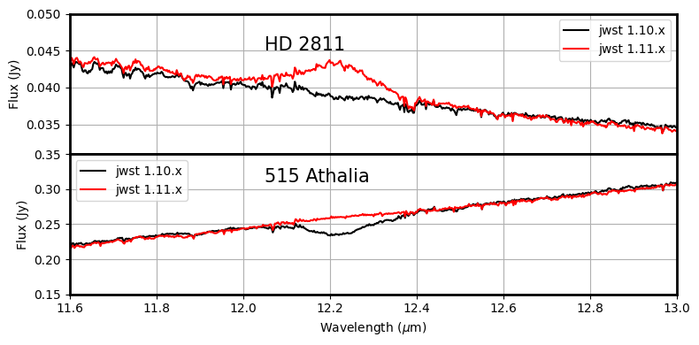

Description
===========

:Class: `jwst.spectral_leak.SpectralLeakStep`
:Alias: spectral_leak
	
The MIRI MRS filters are designed to keep out-of-band light from interfering with the desired first
order wavelengths dispersed in a given band. However, around 12.2 µm (channel 3A) a few-percent spectral leak
admits second-order light from 6 µm (channel 1B) into the bandpass. This results in 
spectra produced by the pipeline containing additional flux around 12.2 µm that is only proportional to the object flux at 6 µm.
As a result, very red targets with little flux around 6 µm now show no evidence of the leak, while very blue targets show a
pronounced 12.2 µm artifact (see figure below).

Applying the optinal spectral leak correction to MIRI MRS data in the  :ref:`calwebb_spec3 <calwebb_spec3>` pipeline corrects for
this feature in  extracted channel 3A spectrum
for a given target using the channel 1B spectrum of that target (if available). Note that since the channel 1B FOV is smaller
than that for Ch3A no such correction is possible in general for extended sources that fill the entire FOV.

Figure: MRS spectral leak as seen for very-blue sources (A-type star HD 2811) and very-red sources (Asteroid 515 Athalia) in 2 different versions of the JWST pipeline.
