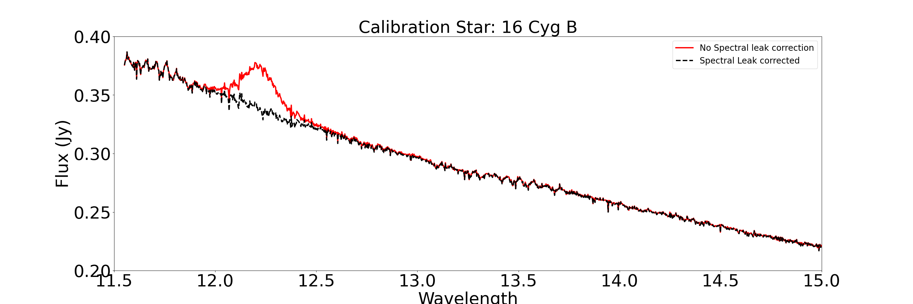

Description
===========

:Class: `jwst.spectral_leak.spectral_leak_step.SpectralLeakStep`
:Alias: spectral_leak

The MIRI MRS filters are designed to keep out-of-band light from interfering with the desired first
order wavelengths dispersed in a given band. However, around 12.2 µm (Channel 3A) a few-percent spectral leak
admits second-order light from 6 µm (Channel 1B) into the bandpass. This results in
spectra produced by the pipeline containing additional flux around 12.2 µm that is only proportional to the object flux at 6 µm.

Applying the optimal spectral leak correction to MIRI MRS data in the  :ref:`calwebb_spec3 <calwebb_spec3>` pipeline corrects for
this feature in extracted Channel 3A spectrum
for a given target using the Channel 1B spectrum of that target (if available). Note that since the Channel 1B FOV is smaller
than that for Channel 3A, no such correction is possible in general for extended sources that fill the entire FOV. An example of an
uncorrected and corrected spectrum is given in the :ref:`figure below <spectral_leak_fig_1>` for a G dwarf star.

.. _spectral_leak_fig_1:

   MRS spectral leak as seen in G dwarf star. The red extracted spectrum does not have the ``spectral_leak`` step applied,
   while the the black extracted spectrum has it applied.

Step Arguments
--------------
The ``spectral_leak`` correction has no step-specific arguments.
